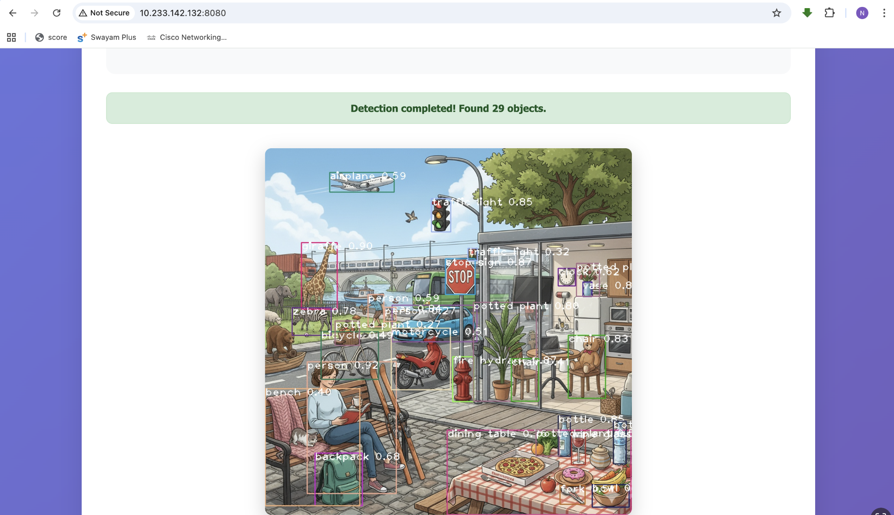

# 🎯 Real-Time Object Detection System


> A real-time object detection web application powered by **YOLOv8** — supports both **image upload** and **live webcam detection** with **80 object classes**, bounding box visualization, and confidence scoring.

---

## 📌 Project Overview

This project implements a complete **Real-Time Object Detection System** using the state-of-the-art **YOLOv8** model. It detects multiple objects simultaneously in uploaded images or live webcam feeds, displaying bounding boxes, class labels, and confidence scores through a clean web interface.

---

## 🎯 Key Highlights

- ✅ Powered by **YOLOv8** — state-of-the-art object detection model
- ✅ Detects **80 COCO object classes** simultaneously
- ✅ **Detected 29 objects** in a single complex image
- ✅ **Image upload** mode — analyze any image instantly
- ✅ **Live webcam detection** — real-time detection via browser
- ✅ Displays **bounding boxes** with class labels and confidence scores
- ✅ Clean, modern **web interface** with detected objects list

---

## 🖼️ Demo

### Image Detection — 29 Objects Detected!



> *YOLOv8 detecting 29 objects simultaneously in a complex scene*

### Sample Detection Results

| Object | Confidence |
|---|---|
| person | **92.0%** |
| giraffe | **90.0%** |
| vase | **87.0%** |
| fire hydrant | **87.0%** |
| stop sign | **87.0%** |
| traffic light | **85.0%** |
| bottle | **85.0%** |
| car | **84.0%** |
| chair | **83.0%** |
| wine glass | **83.0%** |
| zebra | **78.0%** |
| dining table | **76.0%** |
| backpack | **68.0%** |
| airplane | **59.0%** |
| motorcycle | **51.0%** |
| bicycle | **49.0%** |

### Live Webcam Detection
Click **"Start Live Detection"** to activate your webcam for real-time object detection directly in the browser.

---

## 🧠 Model — YOLOv8

**YOLO (You Only Look Once)** processes the entire image in a **single forward pass** of the neural network — making it extremely fast and accurate for real-time applications.

| Property | Details |
|---|---|
| Model | YOLOv8 |
| Dataset | COCO (Common Objects in Context) |
| Classes | 80 object categories |
| Max Objects Detected | 29 in single image |
| Speed | Real-time inference |
| Top Confidence | 92% (person detection) |

### 80 Detectable Classes Include:
`person` `car` `bicycle` `motorcycle` `airplane` `bus` `truck` `dog` `cat` `horse` `elephant` `giraffe` `zebra` `chair` `laptop` `phone` `book` `bottle` `traffic light` `stop sign` `fire hydrant` and 59 more...

---

## 🚀 How to Run

### 1. Clone the repository
```bash
git clone https://github.com/Khiladi-786/Real-Time-object-detection-.git
cd Real-Time-object-detection-
```

### 2. Install dependencies
```bash
pip install -r requirements.txt
```

### 3. Download YOLO weights (auto on first run)
```bash
python -c "from ultralytics import YOLO; YOLO('yolov8n.pt')"
```

### 4. Run the app
```bash
python app.py
```

### 5. Open browser
```
http://localhost:8080
```

---

## 🛠️ Tech Stack

| Tool | Purpose |
|---|---|
| Python | Core programming language |
| YOLOv8 (Ultralytics) | Object detection model |
| OpenCV | Image processing & webcam capture |
| Flask | Web framework & REST API |
| flask-cors | Cross-origin request handling |
| HTML/CSS/JS | Frontend interface |

---

## 📁 Project Structure

```
Real-Time-object-detection-/
│
├── app.py                    # Flask web application
├── requirements.txt          # Python dependencies
├── Object_Detection.py       # Core detection script
├── test_webcam.py            # Webcam testing utility
├── classes.txt               # COCO class names
├── coco.names                # COCO dataset labels
├── demo.png                  # Demo detection screenshot
├── README.md                 # Documentation
│
├── model/
│   ├── yolov8n.pt            # YOLOv8 nano weights
│   └── yolov8s.pt            # YOLOv8 small weights
│
├── static/                   # CSS, JS, assets
└── templates/
    └── index.html            # Web interface
```

---

## 🏆 Results

| Metric | Value |
|---|---|
| Max objects in single image | **29 objects** |
| Top confidence score | **92%** (person) |
| Classes available | **80 COCO classes** |
| Detection mode | Image upload + Live webcam |

---

## 👨‍💻 About the Author

**Nikhil More**
B.Tech CSE (AI/ML) — University of Mumbai (2023–2027)

- 🔗 [LinkedIn](https://www.linkedin.com/in/nikhil-moretech)
- 🐙 [GitHub](https://github.com/Khiladi-786)
- 📧 morenikhil7822@gmail.com

*C-DAC Campus Ambassador | Google Student Ambassador | GfG Campus Mantri*

---

## 📄 License

This project is licensed under the MIT License.

---

⭐ **If you found this project useful, please give it a star!**
