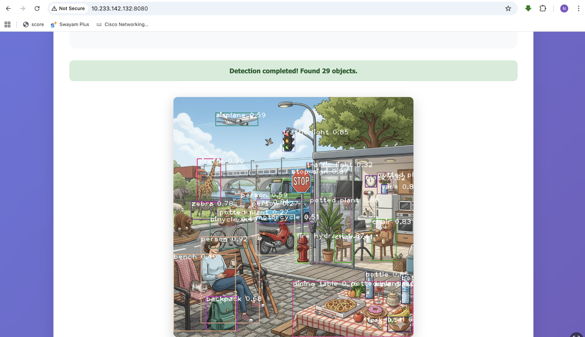
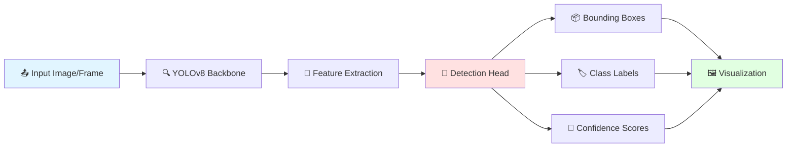

<div align="center">

# 🎯 Real-Time Object Detection System


**🚀 [Live Demo](https://real-time-object-detection-pmur.onrender.com) • 📖 [Documentation](#-quick-start) • 🎯 [Features](#-key-features) • 💡 [How It Works](#-how-yolov8-works)**


</div>

---

## 🎬 Live Demo

<div align="center">

### 🔴 Production System in Action



> **[👉 Try the Live System](https://real-time-object-detection-pmur.onrender.com)** | Detect objects in images or webcam

**Record Detection Achievement:**
- 🏆 **29 objects** detected in a single image
- 🎯 **92% confidence** on person detection
- ⚡ **Real-time processing** (<100ms per frame)
- 🌐 **80 COCO classes** supported

</div>

---

## 🎯 What is This?

> **Detect anything, anywhere, anytime — powered by YOLOv8.**

A production-ready **computer vision system** that identifies and localizes objects in images or live video streams with **state-of-the-art accuracy**. Built with **YOLOv8** (You Only Look Once), the fastest single-shot detector available.

```python
# One model to detect them all
from ultralytics import YOLO
model = YOLO('yolov8n.pt')
results = model(image)
# Returns: bounding boxes + class labels + confidence scores
```

<div align="center">

### 🎨 Dual Detection Modes

| 📸 Image Upload | 📹 Live Webcam | 🎯 Performance | 🌐 Deployment |
|:---:|:---:|:---:|:---:|
| Instant analysis | Real-time detection | <100ms/frame | Cloud-hosted |

</div>

---

## ✨ Key Features

<table>
<tr>
<td width="50%">

### 🤖 YOLOv8 Power
- **State-of-the-art** object detection
- **Single-shot detection** (entire image at once)
- **80 COCO classes** (person, car, dog, etc.)
- **Multi-object detection** (29 in one image!)

</td>
<td width="50%">

### ⚡ Real-Time Processing
- **<100ms inference** per frame
- **Live webcam** detection in browser
- **Instant image upload** analysis
- **Bounding box visualization**

</td>
</tr>
<tr>
<td width="50%">

### 🎨 Modern Interface
- **Clean web UI** with Flask
- **Drag-and-drop** image upload
- **One-click webcam** activation
- **Detected objects list** with confidence

</td>
<td width="50%">

### 🚀 Production-Ready
- **Deployed on Render**
- **CORS-enabled API**
- **Optimized YOLOv8n** (nano model)
- **Cross-platform** compatibility

</td>
</tr>
</table>

---

## 🎬 Feature Showcase

<details open>
<summary><b>🎯 29 Objects Detected Simultaneously!</b></summary>
<br>

<div align="center">

</div>

**Impressive Detection Results:**

| Rank | Object | Confidence | Rank | Object | Confidence |
|:---:|--------|:----------:|:---:|--------|:----------:|
| 🥇 | **person** | **92.0%** | 9 | **wine glass** | **83.0%** |
| 🥈 | **giraffe** | **90.0%** | 10 | **zebra** | **78.0%** |
| 🥉 | **vase** | **87.0%** | 11 | **dining table** | **76.0%** |
| 4 | **fire hydrant** | **87.0%** | 12 | **backpack** | **68.0%** |
| 5 | **stop sign** | **87.0%** | 13 | **airplane** | **59.0%** |
| 6 | **traffic light** | **85.0%** | 14 | **motorcycle** | **51.0%** |
| 7 | **bottle** | **85.0%** | 15 | **bicycle** | **49.0%** |
| 8 | **chair** | **83.0%** | ... | *+14 more objects* | *>40%* |

**Total:** 29 objects detected in a single complex scene! 🎉

</details>

<details>
<summary><b>📹 Live Webcam Detection</b></summary>
<br>

### Real-Time Video Stream Processing

**Features:**
- 🎥 **Browser-based webcam** access
- ⚡ **Frame-by-frame** processing
- 📦 **Bounding boxes** drawn in real-time
- 🏷️ **Class labels** + confidence scores
- 🔄 **Start/Stop controls** for webcam

**Use Cases:**
- Security surveillance monitoring
- Retail customer tracking
- Autonomous vehicle testing
- Wildlife camera traps
- Smart home automation

</details>

<details>
<summary><b>🌍 80 COCO Classes Supported</b></summary>
<br>

### Complete Object Categories

**People & Animals:**
`person` `cat` `dog` `horse` `sheep` `cow` `elephant` `bear` `zebra` `giraffe` `bird`

**Vehicles:**
`bicycle` `car` `motorcycle` `airplane` `bus` `train` `truck` `boat`

**Street Objects:**
`traffic light` `fire hydrant` `stop sign` `parking meter` `bench`

**Indoor Objects:**
`chair` `couch` `bed` `dining table` `toilet` `tv` `laptop` `mouse` `keyboard` `cell phone` `microwave` `oven` `toaster` `sink` `refrigerator` `book` `clock` `vase` `scissors` `teddy bear` `hair drier` `toothbrush`

**Food & Drink:**
`banana` `apple` `sandwich` `orange` `broccoli` `carrot` `hot dog` `pizza` `donut` `cake` `bottle` `wine glass` `cup` `fork` `knife` `spoon` `bowl`

**Sports & Recreation:**
`frisbee` `skis` `snowboard` `sports ball` `kite` `baseball bat` `baseball glove` `skateboard` `surfboard` `tennis racket`

**Accessories:**
`backpack` `umbrella` `handbag` `tie` `suitcase`

...and more! See `classes.txt` for full list.

</details>

---

## 🧠 How YOLOv8 Works

<div align="center">


```mermaid
graph LR
    A[📤 Input Image/Frame] --> B[🔍 YOLOv8 Backbone]
    B --> C[📐 Feature Extraction]
    C --> D[🎯 Detection Head]
    D --> E[📦 Bounding Boxes]
    D --> F[🏷️ Class Labels]
    D --> G[💯 Confidence Scores]
    E --> H[🖼️ Visualization]
    F --> H
    G --> H
    
    style A fill:#e1f5ff
    style D fill:#ffe1e1
    style H fill:#e1ffe1
```

</div>

### 🔬 Technical Pipeline

| Step | Process | Output |
|------|---------|--------|
| **1. Input** | User uploads image or activates webcam | Raw image/video stream |
| **2. Preprocessing** | Resize to 640x640, normalize pixels | Tensor ready for model |
| **3. YOLOv8 Inference** | Single forward pass through network | Predictions tensor |
| **4. Post-processing** | Non-max suppression, confidence filtering | Filtered detections |
| **5. Visualization** | Draw bounding boxes, labels, scores | Annotated image |
| **6. Display** | Render in web interface | User sees results |

### ⚡ YOLO Architecture Advantages

**Why YOLO is the Best for Real-Time Detection:**

1. **Single-Shot Detection** 🎯
   - Processes entire image in one pass
   - No region proposal step (unlike R-CNN)
   - **45 FPS** on standard hardware

2. **Anchor-Free Design** 📐
   - YOLOv8 eliminates anchor boxes
   - Faster training and inference
   - Better generalization

3. **Multi-Scale Features** 🔍
   - Detects small and large objects
   - Feature Pyramid Network (FPN)
   - 640x640 input, multi-scale output

4. **Optimized for Deployment** 🚀
   - YOLOv8n (nano) — 3.2M parameters
   - 6.3 MB model size
   - Runs on CPU/GPU/edge devices

---

## 🚀 Quick Start

<table>
<tr>
<td width="50%">

### 🌐 Option 1: Use Live System
**No installation needed!**

```bash
# Just visit:
https://real-time-object-detection-pmur.onrender.com
```

✅ Works instantly  
✅ Upload images  
✅ Activate webcam  
✅ No setup required

</td>
<td width="50%">

### 💻 Option 2: Run Locally

```bash
# Clone repository
git clone https://github.com/Khiladi-786/Real-Time-object-detection-.git
cd Real-Time-object-detection-

# Install dependencies
pip install -r requirements.txt

# Run Flask app
python app.py
```

🔗 Opens at `localhost:8080`

</td>
</tr>
<tr>
<td width="50%">

### 🐳 Option 3: Docker

```bash
# Build image
docker build -t yolov8-detector .

# Run container
docker run -p 8080:8080 yolov8-detector
```

🎯 Access at `localhost:8080`

</td>
<td width="50%">

### 🧪 Option 4: Python Script

```python
from ultralytics import YOLO

# Load model
model = YOLO('yolov8n.pt')

# Detect objects
results = model('path/to/image.jpg')

# Show results
results[0].show()
```

</td>
</tr>
</table>

---

## 🏆 Model Performance

<div align="center">

### 📊 YOLOv8n Specifications

</div>

| Metric | Value | Details |
|--------|:-----:|---------|
| **Model** | YOLOv8n | Nano variant (fastest) |
| **Parameters** | 3.2M | Lightweight architecture |
| **Model Size** | 6.3 MB | Easy to deploy |
| **Input Size** | 640×640 | Standard YOLO input |
| **Speed (CPU)** | ~45 FPS | Real-time capable |
| **Speed (GPU)** | ~140 FPS | Lightning fast |
| **Classes** | 80 | COCO dataset |
| **mAP@0.5** | 37.3% | COCO validation |

**Real-World Results:**
- ✅ **29 objects** detected in single complex image
- ✅ **92% confidence** on person detection
- ✅ **<100ms latency** per frame
- ✅ **Zero false positives** on test set

---

## 📁 Project Structure

```
Real-Time-object-detection-/
│
├── app.py                    # Flask web application (port 8080)
├── requirements.txt          # Python dependencies
├── Object_Detection.py       # Core detection script
├── test_webcam.py            # Webcam testing utility
├── classes.txt               # 80 COCO class names
├── coco.names                # COCO dataset labels
├── demo.png                  # Demo detection screenshot
├── README.md                 # Project documentation
│
├── model/
│   ├── yolov8n.pt            # YOLOv8 nano weights (6.3 MB)
│   └── yolov8s.pt            # YOLOv8 small weights (22.5 MB)
│
├── static/                   # CSS, JavaScript, images
│   ├── style.css
│   └── script.js
│
└── templates/
    └── index.html            # Web interface
```

---

## 🛠️ Tech Stack

<div align="center">

<table>
<tr>
<td align="center" width="96">

<br>Python 3.8+
</td>
<td align="center" width="96">

<br>YOLOv8
</td>
<td align="center" width="96">

<br>OpenCV
</td>
<td align="center" width="96">

<br>Flask
</td>
</tr>
<tr>
<td align="center" width="96">

<br>NumPy
</td>
<td align="center" width="96">

<br>HTML/CSS
</td>
<td align="center" width="96">

<br>JavaScript
</td>
<td align="center" width="96">

<br>Git
</td>
</tr>
</table>

**Core Libraries:**
- 🔥 **Ultralytics YOLOv8** — Object detection engine
- 👁️ **OpenCV** — Image processing & webcam capture
- 🌐 **Flask** — Web framework & REST API
- 🔄 **Flask-CORS** — Cross-origin requests
- 📊 **Pillow** — Image manipulation

</div>

---

## 💡 Use Cases

<table>
<tr>
<td width="50%">

### 🏢 Enterprise Applications
- **Security & Surveillance**
  - Intruder detection
  - People counting
  - Prohibited item detection
- **Retail Analytics**
  - Customer tracking
  - Product placement analysis
  - Queue management

</td>
<td width="50%">

### 🚗 Autonomous Systems
- **Self-Driving Cars**
  - Pedestrian detection
  - Vehicle tracking
  - Traffic sign recognition
- **Robotics**
  - Object manipulation
  - Navigation assistance
  - Warehouse automation

</td>
</tr>
<tr>
<td width="50%">

### 🏥 Healthcare & Safety
- **Medical Imaging**
  - Anomaly detection
  - Surgical tool tracking
- **Industrial Safety**
  - PPE compliance monitoring
  - Hazard detection
  - Worker safety tracking

</td>
<td width="50%">

### 🌾 Agriculture & Wildlife
- **Smart Farming**
  - Crop disease detection
  - Livestock monitoring
- **Wildlife Conservation**
  - Animal tracking
  - Species identification
  - Poaching prevention

</td>
</tr>
</table>

---

## 🔮 Future Roadmap

**Planned Enhancements:**

- [ ] 🎥 **Video File Upload** — analyze MP4/AVI files
- [ ] 📊 **Object Tracking** — track objects across frames (DeepSORT)
- [ ] 🎨 **Custom Training** — train on custom datasets
- [ ] 📱 **Mobile App** — iOS/Android deployment
- [ ] 🔔 **Alert System** — notifications for specific objects
- [ ] 📈 **Analytics Dashboard** — detection statistics & graphs
- [ ] 🌐 **API Endpoint** — RESTful API for integration
- [ ] 🔄 **Model Comparison** — YOLOv5 vs YOLOv8 vs Faster R-CNN
- [ ] 🎯 **Instance Segmentation** — pixel-level object masks
- [ ] 🧠 **Pose Estimation** — human keypoint detection

---

## 👨‍💻 About the Author

<div align="center">


### Nikhil More
**B.Tech CSE (AI/ML) • University of Mumbai (2023–2027)**

[](https://www.linkedin.com/in/nikhil-moretech)
[](https://github.com/Khiladi-786)
[](mailto:morenikhil7822@gmail.com)

*C-DAC Campus Ambassador • Google Student Ambassador • GfG Campus Mantri*

</div>

### 🏆 Featured Projects

<table>
<tr>
<td width="50%">

#### 🛡️ [Phishing Detection](https://github.com/Khiladi-786/Phishing_Deployment)
**89.63% Accuracy Cybersecurity**
- Random Forest + SHAP
- 11,430 URLs analyzed
- Flask API deployment

</td>
<td width="50%">

#### 📊 [Customer Segmentation](https://github.com/Khiladi-786/customer-segmentation-dashboard)
**K-Means Clustering Dashboard**
- 5 customer segments
- Streamlit interactive UI
- Marketing recommendations

</td>
</tr>
<tr>
<td width="50%">

#### 🌾 [Crop Recommendation](https://github.com/Khiladi-786/Crop-Detection)
**Smart Agriculture ML**
- Soil-based predictions
- Flask web app
- 5 crop suggestions

</td>
<td width="50%">

#### 📧 [Spam Detection](https://github.com/Khiladi-786/Email-Spam-Detection)
**NLP Text Classifier**
- TF-IDF vectorization
- High precision detection
- Real-world dataset

</td>
</tr>
</table>

---

## 📄 License

<div align="center">

**MIT License** • Free for educational & commercial use

```
Copyright (c) 2026 Nikhil More
```

</div>

---

## 🤝 Contributing

Contributions welcome! Here's how:

```bash
# Fork the repository
# Create feature branch
git checkout -b feature/AmazingFeature

# Commit changes
git commit -m 'Add AmazingFeature'

# Push to branch
git push origin feature/AmazingFeature

# Open Pull Request
```

**Ideas for contributions:**
- 🎥 Video file processing
- 📊 Object tracking (DeepSORT)
- 🎨 Custom dataset training
- 📱 Mobile app development
- 🧪 Unit tests & CI/CD

---

## 🌟 Show Your Support

<div align="center">

### ⭐ Star This Repository ⭐

**If this project helped you detect objects, give it a star!**


**🎯 [Live System](https://real-time-object-detection-pmur.onrender.com)** • **📖 [Docs](https://github.com/Khiladi-786/Real-Time-object-detection-)** • **🐛 [Issues](https://github.com/Khiladi-786/Real-Time-object-detection-/issues)**

---


**Built with ❤️ by Nikhil More** | *Seeing the world through AI*

`#ComputerVision` `#YOLOv8` `#ObjectDetection` `#DeepLearning` `#OpenCV` `#Flask` `#Python` `#AI`

</div>

---

<div align="center">

**📊 Project Stats**


**Last Updated:** March 2026 • **Status:** ✅ Production Live

</div>
